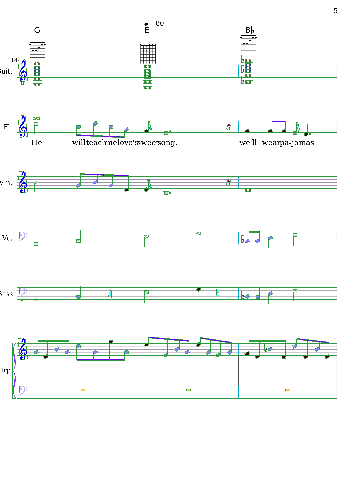
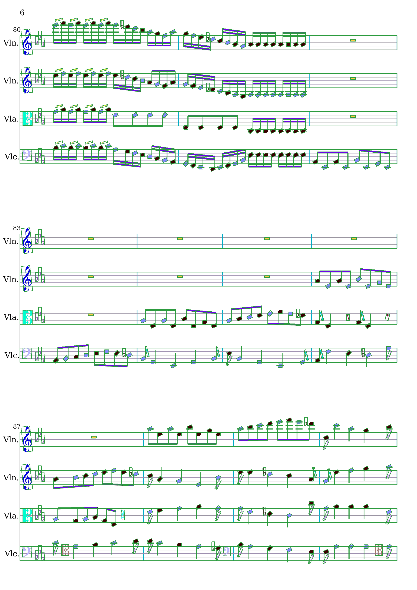
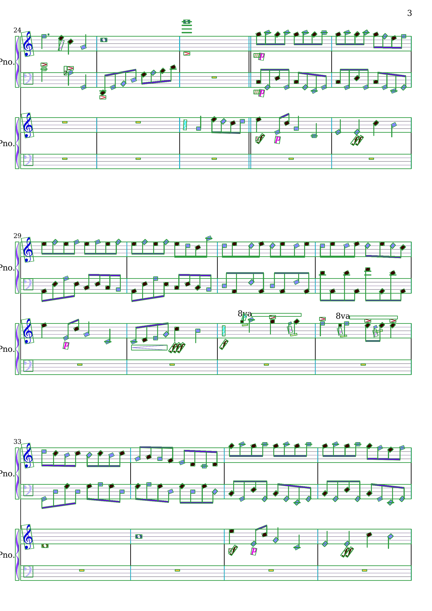
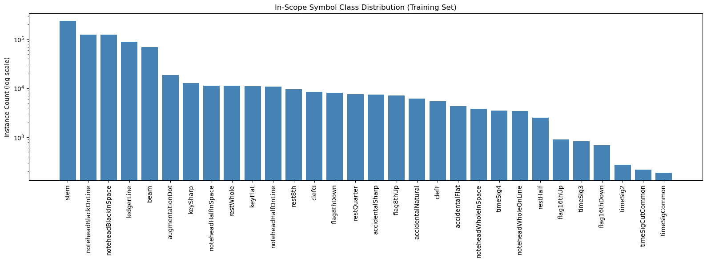
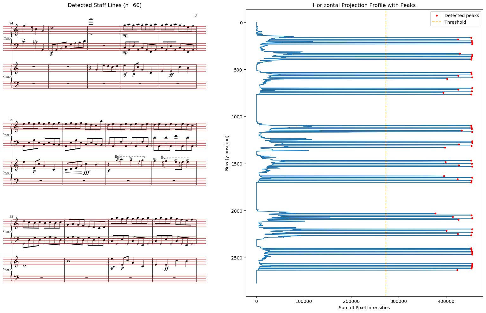
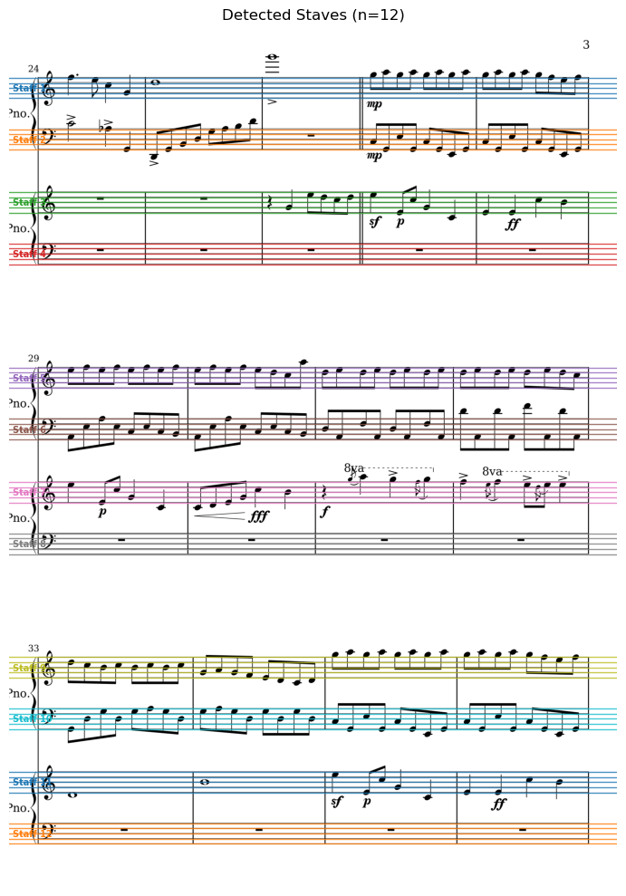

# Check-in 1: Problem Framing & Data

## 1. Problem Framing & Scope

**Modality:** Vision

**Task Definition:**
Given an image of printed sheet music, detect and classify notes and rhythms on the page and convert the results into a MIDI file for audio playback. The main computer vision problem is music object detection. This includes finding and identifying individual symbols (noteheads, rests, clefs, time signatures, beams, stems, accidentals, bar lines) using bounding box detection on full sheet music page images.

**Scope & Constraints:**
- Printed, engraved sheet music only (no handwritten scores)
- Treble and bass clef supported (clefG and clefF)
- Beginner to intermediate complexity (no tuplets, no complex accidentals or rhythms)
- Key signature inferred by counting keySharp/keyFlat symbols per staff and mapping to key via lookup table
- Tempo hardcoded — no dynamic tempo marking recognition
- Dynamics markings (forte, piano, etc.) out of scope

**Success Criteria:**
- Achieve reasonable mAP on the core symbol classes (noteheads, rests, clefs, time signatures, beams, stems, accidentals) on the DeepScores V2 test set
- Successfully convert a detected page into a playable MIDI file end-to-end
- Failure cases documented and analyzed

---

## 2. Dataset Access & Documentation

**Dataset:** DeepScores V2

**Source:** [Zenodo](https://zenodo.org/record/4012193)
 
**Size:**
- Full dataset: 255,385 images, 151 million annotated symbol instances across 135 classes (80.9 GB)
- Dense subset: 1,714 of the most diverse and challenging images (741.8 MB)
- This project uses the dense subset

**License/Usage:**
[Creative Commons Attribution 4.0 International (CC BY 4.0)](https://creativecommons.org/licenses/by/4.0/) — free to use with attribution

**Citation:**
Tuggener, L., Satyawan, Y. P., Pacha, A., Schmidhuber, J., & Stadelmann, T. (2020). DeepScoresV2 (2.0) [Data set]. 25th INTERNATIONAL CONFERENCE ON PATTERN RECOGNITION (ICPR2020), Milan, Italy. Zenodo. https://doi.org/10.5281/zenodo.4012193

**Annotation Format:**
Each image comes with:
- Non-oriented bounding boxes
- Oriented bounding boxes
- Semantic segmentation masks
- Instance segmentation masks

Annotations are provided in JSON format. Each notehead annotation also includes a relative staff position field that can be used to infer the specific note.

**Download Instructions:**
1. Go to [https://zenodo.org/record/4012193](https://zenodo.org/record/4012193)
2. Download `ds2_dense.tar.gz` (741.8 MB) (the full dataset is 80.9 GB and not necessary for this project)
3. Extract: `tar -xzf ds2_dense.tar.gz`

**Useful Resources:**
- [OBBAnns toolkit](https://github.com/yvan674/obb_anns) — official toolkit for loading and inspecting DeepScores V2 annotations

---

## 3. Data Audit & EDA

See the full EDA notebook: [`notebooks/eda.ipynb`](../notebooks/eda.ipynb)

### Dataset Characteristics
The dense subset contains 1,714 images split into 1,362 training images and 352 test images. The training set contains 889,833 annotated symbol instances across 115 unique classes (filtered to the DeepScores annotation set).

The images are pretty high resolution, rendered at 400 DPI, and vary significantly in size (width: 1,597–3,842px, height: 2,259–5,434px, mean ~2,059×2,912px). Full-size images will probably need to be processed as crops or resized.

### Annotation Sets
The dataset has two annotation sets: deepscores and muscima++, which means there are 208 total categories. The muscima++ set is supposed to be for handwritten music and uses a lot of the same symbols but with slightly different names (legerLine vs ledgerLine). Since this project uses only printed music, all of my analysis and training will filter to just the deepscores annotation so that I'm not double counting.

### Sample Visualizations
Sample pages with bounding boxes overlaid are shown below. Key observations:
- The dataset contains orchestral and ensemble scores, sometimes with multiple lines per instrument (violin, viola, cello, piano grand staff, harp, etc.). This is definitely more complex than the beginner/intermediate single-instrument music that is my target use case, but this is the training distribution that the dataset provides
- Both treble (clefG) and bass (clefF) clefs are present across many of the samples
- Some pages contain out-of-scope elements such as guitar chord diagrams, lyrics, and tempo markings which will be treated as noise during inference
- Sometimes, the bounding boxes are overlapping in more complicated passages, which will be a challenge for detection

### In-Scope Class Distribution
The distribution of the training instance counts of the 30 symbol classes that I choose to be in-scope can be seen below. Key observations:

- Noteheads (black, half, whole — on line and in space) have high instance counts (3k–125k each) and are the most important symbols for pitch inference
- Stems (235k) and beams (69k) are the most common symbols overall, and are present on nearly every note
- Clefs: clefG (8,332) and clefF (5,405) both have a lot of examples
- Time signatures: timeSig4 is the most common (3,492) as expected since 4/4 is the most common time signature; timeSigCommon (189) and timeSigCutCommon (218) are less frequent but included
- Key signatures: keySharp (12,685) and keyFlat (10,954) are common enough to handle reliably
- Class imbalance is significant: stems have 235k instances vs timeSig2 with only 274 which will need to be addressed during training using weighted loss or careful per-class evaluation

### Known Limitations & Failure Modes
- Synthetic data only: the dataset is fully rendered from MusicXML, meaning that all of the images are clean with no scanning artifacts, noise, or real-world variation. Models trained on this data may not generalize well to real scanned sheet music
- Complex orchestral scores: the dataset includes dense multi-staff orchestral music rather than only simple beginner pieces, which is the target use case
- Out-of-scope elements: guitar chord diagrams, lyrics,fingering annotations, and other non-standard notation appear in some images and will not be handled

---

## 4. Evaluation Plan

**Metrics:**
- mAP (mean Average Precision) across all in-scope classes - the standard metric for object detection, also used as the primary benchmark in the DeepScores V2 paper
- AP@0.5 IoU per class — reports average precision at 0.5 intersection-over-union threshold, giving a per-class breakdown useful for identifying which symbol types the model struggles with

These metrics are chosen to match the DeepScores V2 paper's evaluation which allows me to directly compare my results with the published Faster R-CNN and Deep Watershed Detector baselines.

- End-to-end correctness: whether a detected page produces a musically plausible MIDI output (evaluated qualitatively on a small held-out set)

**Train/Val/Test Split:**
The dense subset comes with a predefined split:
- Training: 1,362 images
- Test: 352 images

A validation set will be made from the training split (approximately 80/20) for hyperparameter tuning and early stopping, keeping the test set entirely held out until final evaluation.

---

## 5. Initial Baseline & Representation

See [`notebooks/eda.ipynb`](../notebooks/eda.ipynb) for my full implementation and visualizations.

**Classical baseline implemented: Staff Line Detection via Horizontal Projection Profiles**

Staff lines are detected by inverting the grayscale image, summing pixel intensities across each row to produce a projection profile, and identifying peaks above 60% of the maximum value. Lines are then grouped into staves in sets of 5. (source: https://ieeexplore.ieee.org/document/6628585)

**Results on sample page:**
- 60/60 staff lines correctly detected
- 12 staves identified with consistent height (~66px each)
- Zero false positives on a complex orchestral score page

**Early Observations:**
- The synthetic nature of the dataset makes classical CV techniques highly effective. The perfectly clean images mean that the project profiles are extremely sharp and reliable
- This approach might not generalize well to real scanned music (skew, noise, degradation) which is why a deep learning approach should be implemented for check-in 2
- Overall though, staff position detection is a good first step for pitch inference: once staves are located, notehead positions can be connected to their pitch by using the relative staff position annotations already provided in DeepScores V2

---

## Next Steps
- Convert DeepScores V2 annotations to COCO format to make sure they can work with normal detection frameworks
- Fine-tune YOLOv8 or Faster R-CNN on in-scope classes
- Implement template matching as a second classical baseline for symbol classification
- Compare classical vs CNN baseline performance using mAP and AP@0.5