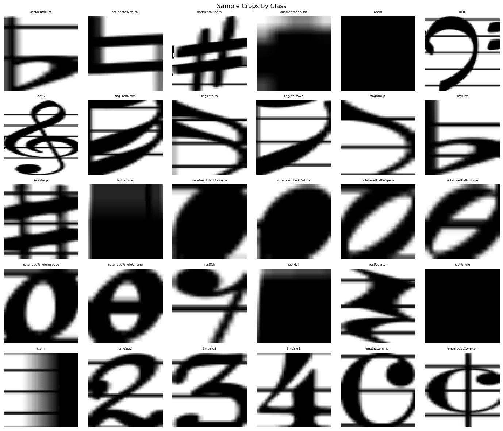
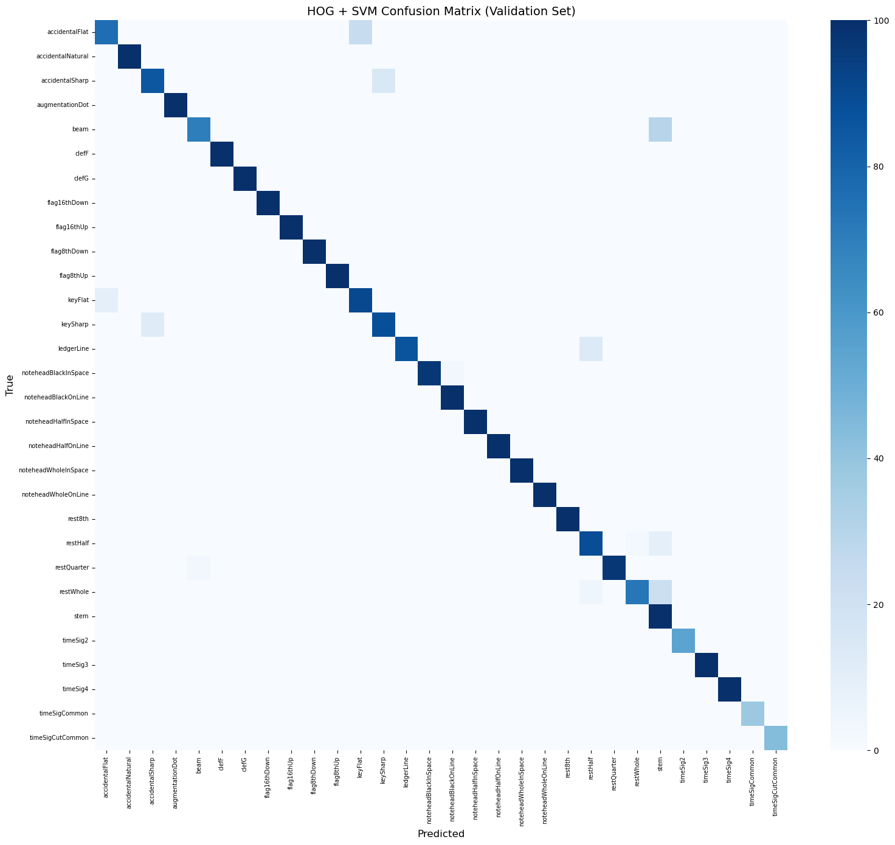
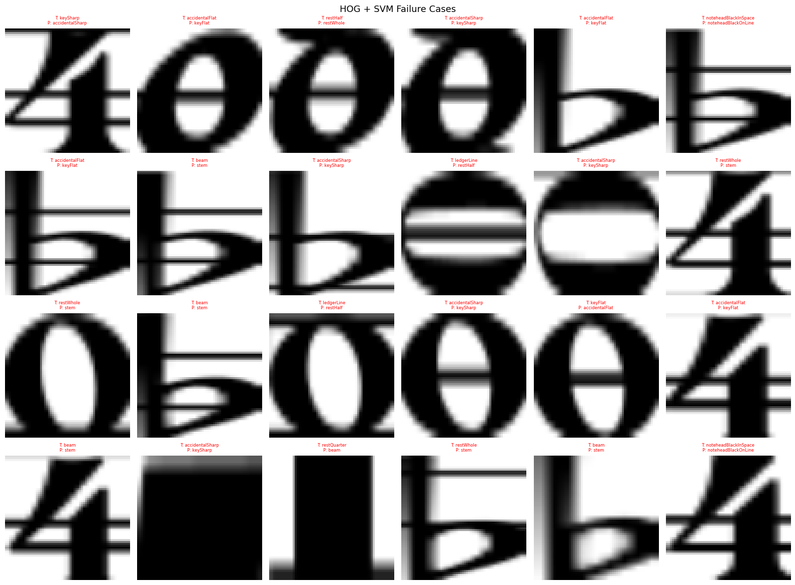
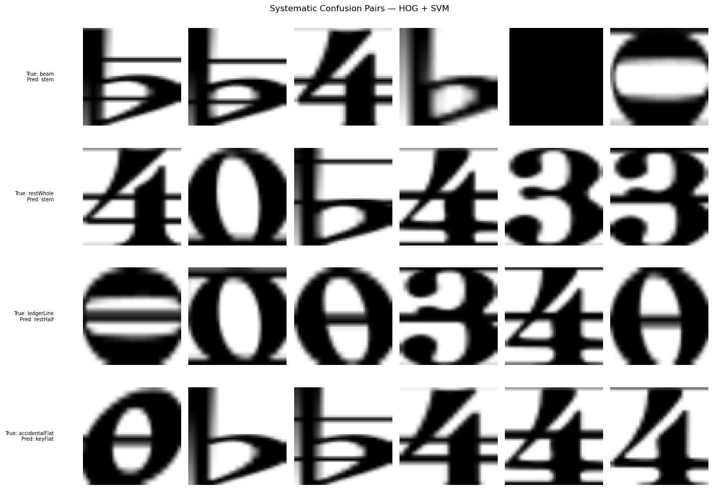
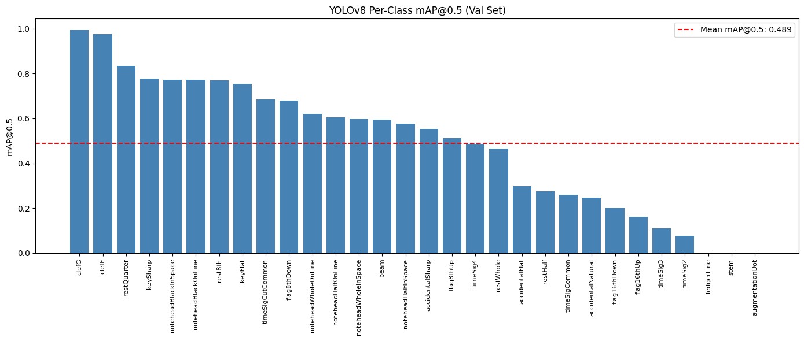
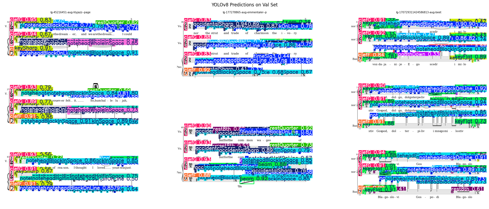
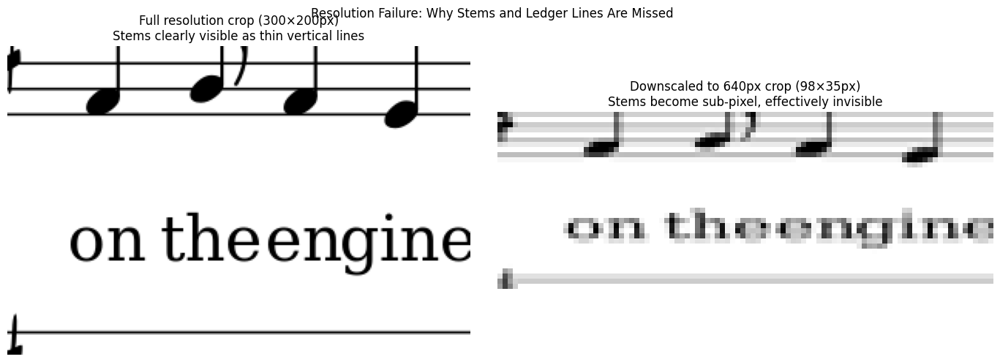

# Check-in 2: Fundamentals Milestone

## Overview
This check-in uses two baselines for musical symbol classification and detection on the DeepScores V2 dataset: a classical HOG + SVM classifier and a YOLOv8 object detector. Both are evaluated on the same 30 in-scope symbol classes defined in Check-in 1, using per-class precision, recall, and F1 as primary metrics for the classical baseline and mAP / AP@0.5 for the CNN detector.

See the full notebooks:
- Classical baseline: [`notebooks/classical_baseline.ipynb`](../notebooks/classical_baseline.ipynb)
- CNN baseline: [`notebooks/cnn_baseline.ipynb`](../notebooks/cnn_baseline.ipynb)

## 1. Classical Baseline: HOG + SVM

### Approach

I used a Histogram of Oriented Gradients (HOG) + Support Vector Machine (SVM) pipeline as the classical baseline. HOG captures local gradient structure and edge orientations in fixed-size image patches, making it a natural choice for symbol classification where shape is the primary distinguishing feature.

Pipeline:
1. Extract symbol crops from ground truth bounding boxes (64×64px, grayscale)
2. Cap at 500 samples per class to balance the heavily skewed class distribution
3. Compute HOG features (9 orientations, 8×8 pixel cells, 2×2 block normalization) — producing a 1,764-dimensional feature vector per crop
4. Train a multi-class SVM with RBF kernel (C=10, gamma=scale)
5. Evaluate on an 80/20 stratified train/validation split (11,344 train / 2,837 val)

Important note: this is a classification baseline, not a full detection pipeline. It uses ground truth bounding boxes to extract crops, meaning it evaluates symbol classification ability in isolation, not the harder problem of finding where symbols are on the page. The YOLOv8 baseline is where I approached the full detection problem.

### Results

Example crops:

Overall validation accuracy: 94.78%

| Class | Precision | Recall | F1 |
|---|---|---|---|
| accidentalFlat | 0.89 | 0.76 | 0.82 |
| accidentalNatural | 1.00 | 1.00 | 1.00 |
| accidentalSharp | 0.88 | 0.85 | 0.86 |
| augmentationDot | 1.00 | 1.00 | 1.00 |
| beam | 0.96 | 0.70 | 0.81 |
| clefF | 1.00 | 1.00 | 1.00 |
| clefG | 1.00 | 1.00 | 1.00 |
| flag16thDown | 1.00 | 1.00 | 1.00 |
| flag16thUp | 1.00 | 1.00 | 1.00 |
| flag8thDown | 1.00 | 1.00 | 1.00 |
| flag8thUp | 1.00 | 1.00 | 1.00 |
| keyFlat | 0.79 | 0.91 | 0.85 |
| keySharp | 0.85 | 0.88 | 0.87 |
| ledgerLine | 1.00 | 0.86 | 0.92 |
| noteheadBlackInSpace | 1.00 | 0.97 | 0.98 |
| noteheadBlackOnLine | 0.97 | 1.00 | 0.99 |
| noteheadHalfInSpace | 1.00 | 1.00 | 1.00 |
| noteheadHalfOnLine | 1.00 | 1.00 | 1.00 |
| noteheadWholeInSpace | 1.00 | 1.00 | 1.00 |
| noteheadWholeOnLine | 1.00 | 1.00 | 1.00 |
| rest8th | 1.00 | 1.00 | 1.00 |
| restHalf | 0.82 | 0.89 | 0.86 |
| restQuarter | 1.00 | 0.97 | 0.98 |
| restWhole | 0.97 | 0.73 | 0.83 |
| stem | 0.62 | 1.00 | 0.77 |
| timeSig2 | 1.00 | 1.00 | 1.00 |
| timeSig3 | 1.00 | 1.00 | 1.00 |
| timeSig4 | 1.00 | 1.00 | 1.00 |
| timeSigCommon | 1.00 | 1.00 | 1.00 |
| timeSigCutCommon | 1.00 | 1.00 | 1.00 |
| macro avg | 0.96 | 0.95 | 0.95 |
| weighted avg | 0.96 | 0.95 | 0.95 |

### Failure Analysis

There were three failure patterns that came from the misclassified crops when I compared them manually:

1. Bounding box context bleed
    Many failure crops contain neighboring symbols rather than the intended symbol. For example, there were crops labeled restWhole or beam that visually contained a "4" from a nearby time signature. This occurs because bounding boxes in DeepScores V2 overlap heavily in dense orchestral scores. This is a fundamental limitation of crop-based classification on densely annotated music, and one that a full detection model like YOLOv8 will probably handle better.

2. Thin symbol ambiguity
    beam, stem, ledgerLine, and restWhole are all thin rectangular shapes. When resized to 64×64, aspect ratio information is destroyed. A wide flat beam and a tall thin stem can produce very similar HOG gradient patterns, for example. HOG without spatial context cannot reliably tell these classes apart. This explains the low precision on stem (0.62) and low recall on beam (0.70) and restWhole (0.73).

3. Contextually identical symbols
    accidentalFlat and keyFlat are the same visual symbol (♭). Their difference is purely musical and contextual (a flat in a key signature vs. a flat next to a note). HOG has no access to this context, making confusion between them unavoidable without higher-level score layout understanding. The same applies to accidentalSharp vs keySharp.

Key takeaway: HOG+SVM performs surprisingly well (94.78%) on visually different symbols but fails systematically on context-dependent and shape-similar classes. These are exactly the failure modes that motivate a spatial detection approach with learned feature hierarchies in the CNN baseline.

## 2. CNN Baseline: YOLOv8

### Approach
I decided to use YOLOv8s (the small variant of YOLOv8) as the CNN baseline, fine-tuned on the DeepScores V2 dense training set filtered to our 30 in-scope symbol classes.

Unlike the HOG+SVM classifier which operates on pre-cropped symbols using ground truth bounding boxes, YOLOv8 performs full object detection. It takes a raw sheet music page image as input and predicts bounding boxes and class labels from scratch. This makes it a harder but more realistic task.

Data preparation:
I had to convert the DeepScores V2 annotations from the OBBAnns JSON format to YOLO format using src/data_utils.py. This involved:
- Filtering to in-scope classes only (30 classes)
- Mapping DeepScores category names to integer class IDs (0–29)
- Converting absolute bounding boxes [x0, y0, x1, y1] to normalized YOLO format [cx, cy, w, h] relative to image dimensions
- Writing one .txt label file per image
- 387 degenerate bounding boxes skipped out of ~1.1 million total (negligible)

Training configuration:
- Model: YOLOv8s (pretrained on COCO, fine-tuned on DeepScores V2)
- Image size: 640px
- Batch size: 8
- Epochs: 50 (with early stopping, patience=10)
- Hardware: NVIDIA Tesla T4 (Google Colab)
- Optimizer: default AdamW
- Validation set: DeepScores V2 test split (352 images)

Why YOLOv8 over Faster R-CNN:
The DeepScores V2 paper uses Faster R-CNN as its baseline. YOLOv8 was chosen here for the faster training time on a single GPU. This means that directly  comparing my model to the paper's Faster R-CNN results will be approximate, but the evaluation metrics (mAP@0.5) are the same.

### Results

Overall mAP@0.5: 0.489 | mAP@0.5:0.95: 0.275

Training completed in 1.86 hours on a Tesla T4 GPU (50 epochs, early stopping patience=10). The model did not trigger early stopping, suggesting continued improvement was possible beyond 50 epochs.

| Class | mAP@0.5 |
|---|---|
| clefG | 0.995 |
| clefF | 0.976 |
| restQuarter | 0.835 |
| keySharp | 0.777 |
| noteheadBlackInSpace | 0.773 |
| noteheadBlackOnLine | 0.773 |
| rest8th | 0.769 |
| keyFlat | 0.755 |
| timeSigCutCommon | 0.684 |
| flag8thDown | 0.680 |
| noteheadWholeOnLine | 0.620 |
| noteheadHalfOnLine | 0.605 |
| noteheadWholeInSpace | 0.596 |
| beam | 0.595 |
| noteheadHalfInSpace | 0.577 |
| accidentalSharp | 0.553 |
| flag8thUp | 0.511 |
| timeSig4 | 0.487 |
| restWhole | 0.465 |
| accidentalFlat | 0.299 |
| restHalf | 0.276 |
| timeSigCommon | 0.260 |
| accidentalNatural | 0.248 |
| flag16thDown | 0.200 |
| flag16thUp | 0.162 |
| timeSig3 | 0.112 |
| timeSig2 | 0.077 |
| ledgerLine | 0.000 |
| stem | 0.000 |
| augmentationDot | 0.000 |

### Failure Analysis

1. Resolution-induced disappearance of thin symbols
The three complete failures (stem (0.000), ledgerLine (0.000), and augmentationDot (0.000)) share a common cause: they are extremely thin or small symbols that become sub-pixel when images are downscaled from full resolution (~1960×2772px) to YOLOv8's inference size (640×480px). A stem that is 3-4px wide at full resolution effectively disappears at 640px. This is visible in the resolution comparison visualization below. Stems are clearly distinguishable at full resolution but become indistinct blobs at inference resolution. This is a known challenge in OMR: the DeepScores V2 paper reported the same stem detection failure with their Faster R-CNN baseline.

Proposed fix for check-in 3: train at higher resolution (imgsz=1280 or 1600) or use a tiling approach where the full-res image is split into overlapping crops, detected at full resolution, and results merged.

2. Rare class underperformance
timeSig2 (0.077), timeSig3 (0.112), and flag16thUp (0.162) all have
very few training instances (274, 823, and 263 respectively). The model simply hasn't seen enough examples to generalize well.

3. Visually similar accidentals
accidentalFlat (0.299) and accidentalNatural (0.248) perform poorly relative to accidentalSharp (0.553). Flats and naturals are visually similar to key signature symbols and to each other, and their small size at inference resolution compounds the problem.

## 3. Comparison

### Metrics Summary

| | HOG + SVM | YOLOv8 |
|---|---|---|
| Task | Crop-level classification | Full page detection |
| Primary metric | Accuracy / macro F1 | mAP@0.5 |
| Overall result | 94.78% accuracy, F1=0.95 | mAP@0.5=0.489 |
| Best classes | clefs, flags, time sigs (F1=1.00) | clefG (0.995), clefF (0.976) |
| Worst classes | stem (F1=0.77), beam (F1=0.81) | stem (0.000), ledgerLine (0.000) |
| Training time | ~5 min (SVM fit) | 1.86 hours (GPU) |
| Input | Pre-cropped symbol (GT bbox) | Raw full page image |

### Discussion

The two baselines are solving  different problems so direct numerical comparison is not straightforward. The HOG+SVM classifier operates on ground truth crops. It is given the correct bounding box and only needs to classify the symbol inside. YOLOv8 must find and classify symbols from scratch on a full page with hundreds of overlapping objects. The CNN baseline is the harder and more realistic task.

That said, several patterns are consistent across both baselines.

What both models agree on:
- Clefs are easy. Both achieve near-perfect performance. Their large, distinctive shapes are unambiguous at any resolution
- Stems are hard. HOG+SVM has low precision on stems (0.62) due to shape ambiguity; YOLOv8 fails entirely due to resolution loss. This is the most consistent failure mode across both approaches
- Key signatures perform well. keySharp and keyFlat are reliably detected by both models, which is important for pitch inference

Where the CNN wins:
- Full detection pipeline. YOLOv8 finds symbols on a raw page without needing ground truth bounding boxes, which is the real task
- Scale awareness. The feature pyramid network handles multi-scale symbols better than fixed 64×64 HOG crops
- Notehead detection is strong and reliable, which is the most important class for musical output

Where HOG+SVM wins:
- On visually distinctive symbols given clean crops, HOG+SVM is extremely accurate (F1=1.00 on many classes). This suggests the classification problem itself is largely solved. The hard problem is detection and localization
- No GPU required, trains in minutes

Key insight:
The dominant failure mode for both models is thin symbol detection like stems, ledger lines, and augmentation dots. For HOG+SVM this is a shape ambiguity problem; for YOLOv8 it is a resolution problem. Check-in 3 will address this directly by training at higher resolution or using a tiled inference approach, and potentially switching to a transformer-based backbone with better small-object detection.

## 4. End-to-End Demo

See [`notebooks/cnn_baseline.ipynb`](../notebooks/cnn_baseline.ipynb) for the full runnable demo.

### Pipeline
Given a sheet music page image, the full pipeline is:

1. Detection — YOLOv8s (trained on DeepScores V2) detects and classifies all in-scope musical symbols on the page, returning bounding boxes, class labels, and confidence scores
2. Staff line detection — horizontal projection profile detects all staff lines, which are grouped into staves (5 lines each) and then into systems (rows of staves) by detecting large vertical gaps
3. Staff assignment — each detection is assigned to its nearest staff based on bounding box center y-coordinate
4. Clef identification — the most confident clefG or clefF detection on each staff determines whether it is treble or bass clef
5. Key inference — keySharp and keyFlat detections are counted per staff and mapped to a key signature via lookup table (e.g. 2 sharps → D major)
6. Time signature inference — timeSig detections are parsed from the first system; stacked numerals (e.g. timeSig4 + timeSig4) are combined into a time signature
7. Pitch assignment — each notehead's center y-coordinate is converted to a staff position integer relative to the middle staff line, then mapped to a pitch (A–G) and octave via clef-specific lookup table
8. Rhythm assignment — notehead type determines base duration (black=quarter, half=half, whole=whole); nearby beam and flag detections adjust black noteheads to eighth or sixteenth notes
9. MIDI export — treble staves across all systems are concatenated into one music21 Part, bass staves into another, combined into a Score, and exported to a .mid file

### Scope and Limitations
- Only treble (clefG) and bass (clefF) staves are converted, other clef types are ignored
- Treble and bass parts are each concatenated across all systems on the page, making this well-suited for piano sheet music (one treble + one bass part) but not for complex orchestral scores where multiple instruments share the same clef type
- Ties, slurs, dynamics, and ornaments are not handled, they are out of scope for this milestone
- Pitch inference depends on accurate staff line detection and notehead localization; errors in either propagate to incorrect pitches
- Multi-staff synchronization is approximate. Parts are concatenated one after the other rather than actually matching up by beat position

## 5. Next Steps

The following improvements are planned for Check-in 3:

Addressing the resolution failure (highest priority)
The complete failure on stem, ledgerLine, and augmentationDot is directly caused by downscaling high-resolution sheet music to 640px for inference. Check-in 3 will address this by either:
- Training at higher resolution (imgsz=1280 or 1600) to preserve thin symbol detail
- Implementing a tiled inference approach where full-res pages are split into overlapping crops, detected at full resolution, and merged via non-maximum suppression

Advanced model extension
As the check-in 3 advanced topic, I plan to explore one of:
- A Vision Transformer (ViT) based detection backbone, which may handle the extreme scale variation between symbol classes better than the CNN feature pyramid
- A larger YOLOv8 variant (YOLOv8m or YOLOv8l) trained at higher resolution

MIDI pipeline refinement
The end-to-end MIDI conversion pipeline introduced in this check-in will be refined based on listening tests especially related to pitch assignment accuracy and rhythm inference for beamed note groups.

Improving rare class performance
timeSig2, timeSig3, and flag16thUp/Down underperform due to low training instance counts. Data augmentation strategies targeting these classes will be explored.
