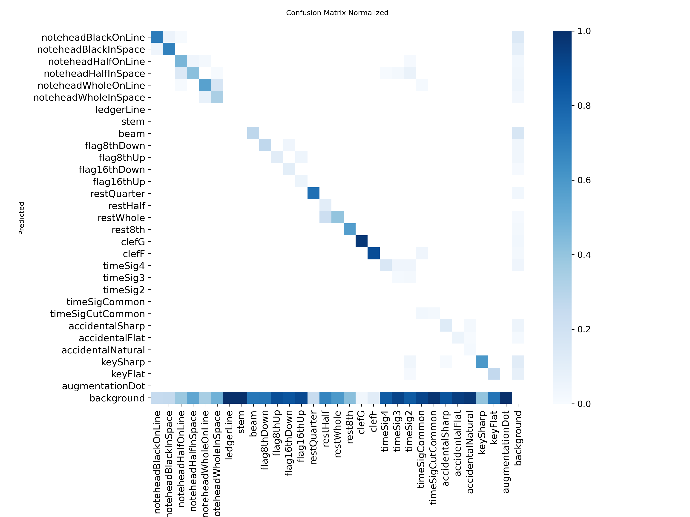
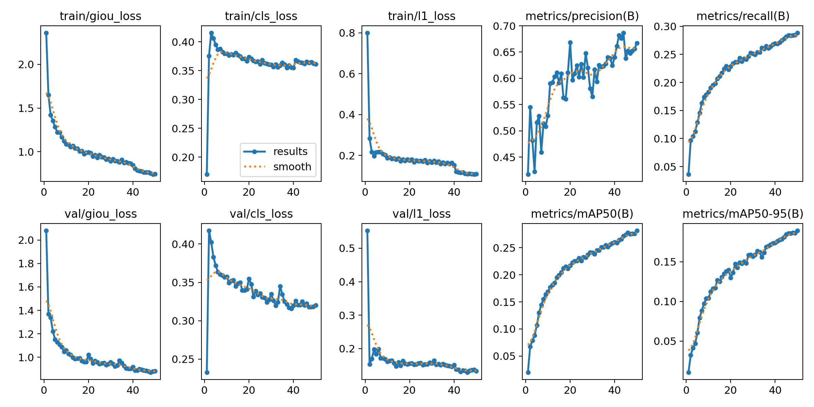
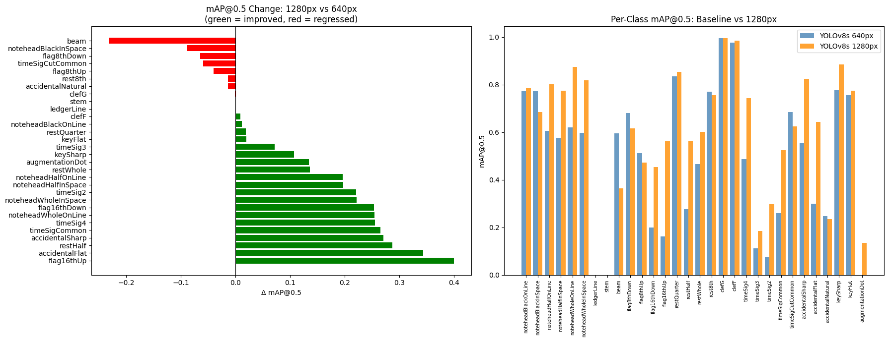
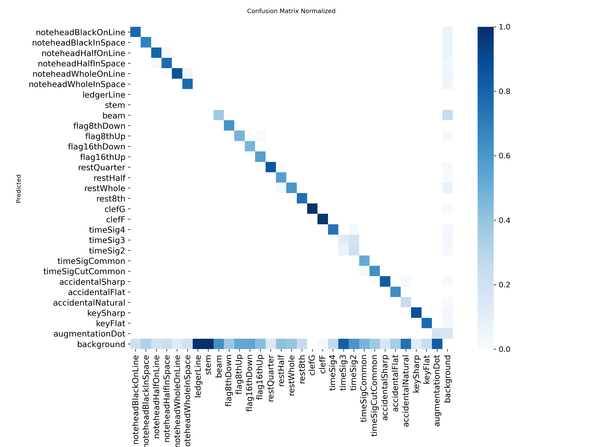
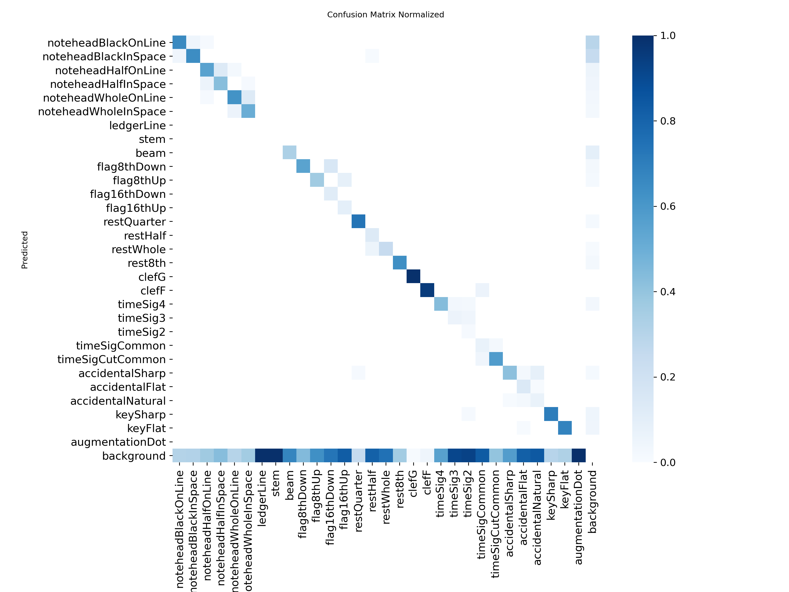
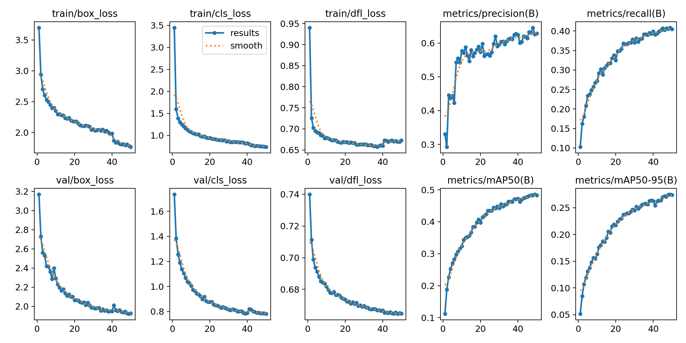
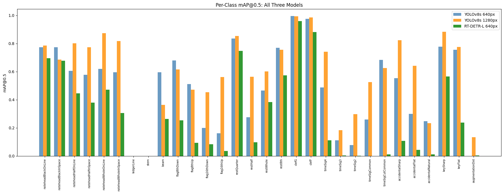
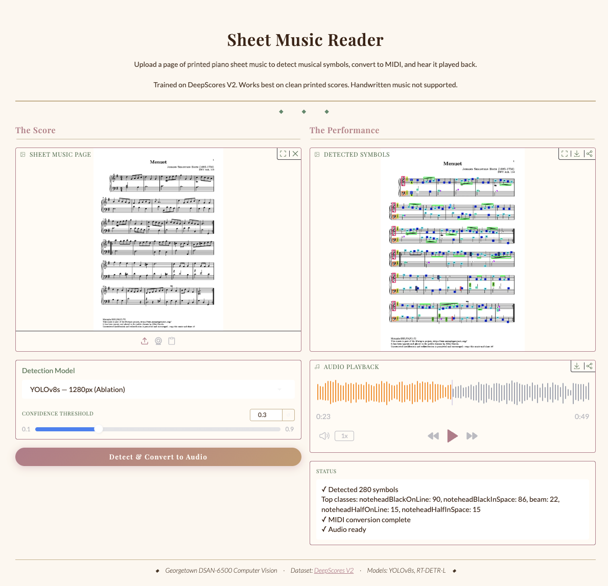

# Check-in 3: Advanced Extension

## Overview
This check-in extends the YOLOv8s baseline from Check-in 2 in two ways:
1. **Advanced extension:** RT-DETR, a transformer-based object detector, replacing the CNN backbone with an attention-based architecture
2. **Ablation:** YOLOv8s trained at higher resolution (imgsz=1280) to directly address the stem/ledgerLine zero-detection failure identified in Check-in 2

See the full noteboosk: 
- [`notebooks/advanced_extension_rtdetr.ipynb`](../notebooks/advanced_extension_rtdetr.ipynb)
- [`notebooks/advanced_extension_ablation.ipynb`](../notebooks/advanced_extension_ablation.ipynb)

---

## 1. Advanced Extension: RT-DETR (Transformer-Based Detection)

### Motivation
The main problem found in Check-in 2 was complete zero-detection on stem, ledgerLine, and augmentationDot. These are all thin/small symbols that disappear when high-resolution sheet music is downscaled to 640px. Another motivation was trying to compare the purely CNN approach in YOLOv8 with RT-DETR which has a transformer-based encoder (AIFI = Attention-based Intra-scale Feature 
Interaction), which may better capture global context and long-range dependencies between symbols.

### Architecture
RT-DETR-L uses:
- HGNet backbone (hybrid CNN feature extractor)
- AIFI transformer encoder for multi-scale feature interaction
- RT-DETR decoder with learned object queries

Key difference from YOLOv8: the AIFI module applies self-attention across spatial positions at the highest feature map level, allowing the model to reason about relationships between distant symbols. This could potentially help with context-dependent 
classes like `accidentalFlat` vs `keyFlat`.

Model size: 32.8M parameters, 108.1 GFLOPs (vs YOLOv8s: 11.1M params, 28.7 GFLOPs)

### Training Configuration
- Model: RT-DETR-L (pretrained on COCO)
- Image size: 640px
- Batch size: 4
- Epochs: 50 (patience=10)
- Hardware: Tesla T4 (Google Colab)
- Dataset: DeepScores V2 dense subset (same as Check-in 2)

### Results

**Overall mAP@0.5: 0.281 | mAP@0.5:0.95: 0.189**

Training completed over 50 epochs (resumed across multiple sessions due to GPU 
memory constraints on the T4). Best model saved at epoch 50.

| Class | RT-DETR mAP@0.5 | YOLOv8s 640px mAP@0.5 | Δ |
|---|---|---|---|
| noteheadBlackOnLine | 0.695 | 0.773 | -0.078 |
| noteheadBlackInSpace | 0.678 | 0.773 | -0.095 |
| noteheadHalfOnLine | 0.445 | 0.605 | -0.160 |
| noteheadHalfInSpace | 0.379 | 0.577 | -0.198 |
| noteheadWholeOnLine | 0.471 | 0.620 | -0.149 |
| noteheadWholeInSpace | 0.305 | 0.596 | -0.291 |
| ledgerLine | 0.000 | 0.000 | 0.000 |
| stem | 0.000 | 0.000 | 0.000 |
| beam | 0.263 | 0.595 | -0.332 |
| flag8thDown | 0.254 | 0.680 | -0.426 |
| flag8thUp | 0.094 | 0.511 | -0.417 |
| flag16thDown | 0.084 | 0.200 | -0.116 |
| flag16thUp | 0.035 | 0.162 | -0.127 |
| restQuarter | 0.748 | 0.835 | -0.087 |
| restHalf | 0.097 | 0.276 | -0.179 |
| restWhole | 0.384 | 0.465 | -0.081 |
| rest8th | 0.574 | 0.769 | -0.195 |
| clefG | 0.960 | 0.995 | -0.035 |
| clefF | 0.881 | 0.976 | -0.095 |
| timeSig4 | 0.111 | 0.487 | -0.376 |
| timeSig3 | 0.004 | 0.112 | -0.108 |
| timeSig2 | 0.001 | 0.077 | -0.076 |
| timeSigCommon | 0.000 | 0.260 | -0.260 |
| timeSigCutCommon | 0.011 | 0.684 | -0.673 |
| accidentalSharp | 0.107 | 0.553 | -0.446 |
| accidentalFlat | 0.044 | 0.299 | -0.255 |
| accidentalNatural | 0.011 | 0.248 | -0.237 |
| keySharp | 0.566 | 0.777 | -0.211 |
| keyFlat | 0.238 | 0.755 | -0.517 |
| augmentationDot | 0.004 | 0.000 | +0.004 |





### Failure Analysis: RT-DETR

#### Overall underperformance vs YOLOv8s 
RT-DETR-L does way worse than YOLOv8s on pretty much every single class. This is a significant and somewhat surprising result given RT-DETR's larger capacity (32.9M vs 11.1M parameters) and transformer-based architecture. The most likely explanation is dataset size. Since RT-DETR uses learned object queries that require sufficient data to converge to meaningful representations, the model might not have had enough to go off of. There were only 1,362 training images, so the transformer's attention mechanism might not have been able to learn reliable query embeddings for 30 classes of densely packed symbols.

#### Worst regressions vs baseline
- `timeSigCutCommon`: -0.673 — rare class (45 val instances), transformer queries never learn this symbol reliably
- `keyFlat`: -0.517, `accidentalSharp`: -0.446 — contextually similar symbols that require local context to distinguish; ironically the transformer's global attention may be introducing noise here rather than helping
- All flag variants: -0.40 to -0.43 — small thin symbols that the CNN feature pyramid localizes better than the transformer decoder

#### Persistent zeros
`stem` and `ledgerLine` remain at zero — consistent with YOLOv8s results, confirming this is an annotation-level problem rather than an issue with the architecture.

#### Why transformers struggled here
This result makes sense since sheet music object detection is a dense small-object problem with strong local structure (staff lines, regular spacing) that CNN feature pyramids are well-suited for. Transformers excel at tasks requiring global context. In sheet music, local features (shape, size, position relative to staff lines) are the primary differentiator between classes, not global relationships. More data (the full 255k DeepScores V2 dataset rather than the 1,714-image dense subset) would probably help with these results.

---

## 2. Ablation: YOLOv8s at Higher Resolution (imgsz=1280)

### Motivation
The stem/ledgerLine zero-detection failure in Check-in 2 was directly caused by downscaling 1960×2772px sheet music pages to 640px for inference. Stems that are 3-4px wide at full resolution become less than a pixel wide and invisible. Training and inferring at 1280px might help save some of the more fine-grained detail.

### Training Configuration
- Model: YOLOv8s (same architecture as Check-in 2 baseline)
- Image size: 1280px (vs 640px in baseline)
- Batch size: 4 (reduced from 8 due to memory)
- Epochs: 50 (patience=10)
- Everything else identical to Check-in 2

### Results
Training completed in 2.26 hours on a Tesla T4 GPU, with early stopping triggering at epoch 37 (best model at epoch 27).

**Overall mAP@0.5: 0.594 | mAP@0.5:0.95: 0.445**

This represents a 0.105 improvement in mAP@0.5 over the 640px baseline (0.489) using the identical model architecture. This was a 21% relative gain purely from resolution.

| Class | mAP@0.5 (640px) | mAP@0.5 (1280px) | Δ |
|---|---|---|---|
| noteheadBlackOnLine | 0.773 | 0.785 | +0.012 |
| noteheadBlackInSpace | 0.773 | 0.685 | -0.088 |
| noteheadHalfOnLine | 0.605 | 0.801 | +0.196 |
| noteheadHalfInSpace | 0.577 | 0.774 | +0.197 |
| noteheadWholeOnLine | 0.620 | 0.874 | +0.254 |
| noteheadWholeInSpace | 0.596 | 0.818 | +0.222 |
| ledgerLine | 0.000 | 0.000 | 0.000 |
| stem | 0.000 | 0.000 | 0.000 |
| beam | 0.595 | 0.363 | -0.232 |
| flag8thDown | 0.680 | 0.615 | -0.065 |
| flag8thUp | 0.511 | 0.471 | -0.040 |
| flag16thDown | 0.200 | 0.453 | +0.253 |
| flag16thUp | 0.162 | 0.562 | +0.400 |
| restQuarter | 0.835 | 0.854 | +0.019 |
| restHalf | 0.276 | 0.563 | +0.287 |
| restWhole | 0.465 | 0.601 | +0.136 |
| rest8th | 0.769 | 0.755 | -0.014 |
| clefG | 0.995 | 0.994 | -0.001 |
| clefF | 0.976 | 0.985 | +0.009 |
| timeSig4 | 0.487 | 0.742 | +0.255 |
| timeSig3 | 0.112 | 0.184 | +0.072 |
| timeSig2 | 0.077 | 0.298 | +0.221 |
| timeSigCommon | 0.260 | 0.525 | +0.265 |
| timeSigCutCommon | 0.684 | 0.625 | -0.059 |
| accidentalSharp | 0.553 | 0.824 | +0.271 |
| accidentalFlat | 0.299 | 0.642 | +0.343 |
| accidentalNatural | 0.248 | 0.234 | -0.014 |
| keySharp | 0.777 | 0.884 | +0.107 |
| keyFlat | 0.755 | 0.775 | +0.020 |
| augmentationDot | 0.000 | 0.134 | +0.134 |



#### Confusion Matrix Comparison

The normalized confusion matrices below show detection patterns for both YOLOv8s models. The diagonal represents correct detections where darker = better.

#### 1280 px



#### 640 px



Key observations:
- The diagonal is consistently stronger at 1280px for notehead variants, accidentals, and time signatures. This confirms the quantitative improvements
- `stem` and `ledgerLine` rows are entirely blank in both matrices. There are zero detections regardless of resolution, confirming an annotation-level failure
- The `background` row shows where missed detections go. Both models struggle with the same classes (thin symbols, rare classes)
- `beam` confusion pattern is similar across both resolutions, suggesting the mAP regression at 1280px is an IoU precision issue rather than outright misclassification

#### Training Curves

#### 1280 px


#### 640 px



The 1280px model shows steeper loss curves and higher final precision/recall, converging to a better optimum despite early stopping at epoch 37. 

### Failure Analysis

#### Unchanged failures — stem and ledgerLine (mAP@0.5 = 0.000)

Despite doubling inference resolution, stem and ledgerLine detection remains at zero. This might mean that this is an annotation quality issue. Stem bounding boxes in DeepScores V2 are extremely thin (1-2px wide at full resolution), which might make it really difficult for any detector to achieve sufficient IoU overlap, even when the stem is visually there. A specialized thin-structure detector or a different annotation strategy (e.g. skeleton-based representation) might be needed to solve this.


#### Beam regression (0.595 → 0.363)
Weirdly, beam detection got worse at higher resolution. The likely cause is IoU threshold sensitivity. The beam bounding boxes are very wide and thin, and at 1280px, small localization errors are penalized more heavily by the 0.5 IoU threshold. The model is finding beams but drawing slightly imprecise boxes around them.

#### augmentationDot now detected (0.000 → 0.134)
This is a meaningful improvement. Augmentation dots were completely invisible at 640px but are now being detected at 1280px, confirming that resolution was the limiting factor for this class specifically.

#### Overall pattern
Higher resolution helps most for: small isolated symbols (dots, accidentals, flags, whole notes) where the limiting factor was pixel-level detail. It helps least for: structurally thin symbols (stems, ledger lines) where the annotation format is the bottleneck, and wide thin symbols (beams) where IoU scoring becomes harder.

---

## 3. Comparison

### Metrics Summary

| Model | Params | imgsz | mAP@0.5 | mAP@0.5:0.95 | stem | ledgerLine | augDot |
|---|---|---|---|---|---|---|---|
| YOLOv8s baseline | 11.1M | 640px | 0.489 | 0.275 | 0.000 | 0.000 | 0.000 |
| **YOLOv8s 1280px** | **11.1M** | **1280px** | **0.594** | **0.445** | **0.000** | **0.000** | **0.134** |
| RT-DETR-L | 32.9M | 640px | 0.281 | 0.189 | 0.000 | 0.000 | 0.004 |

### Discussion



The three-way comparison tells a clear and somewhat surprising story.

#### Resolution beats architecture
The single most impactful intervention was doubling inference resolution. The same model, same training data, same architecture, but with 1280px instead of 640px resulted in a 21% relative improvement in mAP@0.5 (0.489 → 0.594). This does better than switching to a transformer-based architecture by a wide margin (RT-DETR: 0.281).

#### Bigger is not always better
RT-DETR-L has 3x the parameters of YOLOv8s and uses self-attention to capture global context. This was hypothesized to be better at context-dependent symbol separation. In practice it did worse on almost every single class. The most likely cause is dataset size: transformer architectures require more data to learn meaningful attention patterns, and 1,362 training images was not enough for a 32.9M parameter model and 50 epochs was not enough for convergence. The full DeepScores V2 dataset (255k images) might have made the model perform better.

#### What CNN feature pyramids do well here
Sheet music object detection is a dense local-feature problem. Symbol identity is determined by local shape (a filled oval = notehead, a curved line = clef), not by global context. YOLOv8's feature pyramid network is specifically designed for multi-scale local feature extraction, making it well-matched to this task.

#### The persistent annotation problem
Across all three models (HOG+SVM, YOLOv8s at both resolutions, and RT-DETR) stem and ledgerLine detection remains at zero. This is the one finding that no architectural or resolution change can fix. It is an annotation limitation: bounding boxes around 1-2px wide lines cannot be predicted reliably by any box-based detector. Skeleton-based or keypoint-based annotation would be needed.

#### Practical takeaway
For deployment, YOLOv8s at 1280px is the clear winner. It had stronger performance, faster inference than RT-DETR (15.6ms vs 65.0ms per image), and lower memory requirements. The transformer might be worth revisiting in the future, however, with significantly more training data and computational power.

---

## 4. End-to-End Demo

The full pipeline demo is available as a local Gradio app in `src/app.py`. All 3 models are available for testing. Alternatively, there is a version of the app hosted on [Hugging Face](https://huggingface.co/spaces/samyu-vakkalanka/sheet-music-reader), but only the two YOLO models are available due to file size constraints.

**To run:**
```bash
pip install ultralytics gradio music21 midi2audio
brew install fluidsynth  # Mac only
python src/app.py
```

Then open `http://127.0.0.1:7860` in your browser.

### Pipeline Description

The conversion from image to audio involves two stages:

#### Stage 1 — Symbol Detection (`src/app.py` → YOLOv8/RT-DETR)
The uploaded image is passed through the trained detector which returns bounding boxes, class labels, and confidence scores for every detected musical symbol.

#### Stage 2 — Music Theory Post-Processing (`src/midi_converter.py`)
The detections are converted to audio through the following steps:

1. Staff line detection — horizontal projection profiles identify the y-coordinates of all staff lines on the page. Lines are grouped into staves (5 lines each) using consistent spacing.

2. Staff assignment — each detection is assigned to its nearest staff based on bounding box center y-coordinate. Clef type (treble/bass) is determined by the most confident `clefG` or `clefF` detection on each staff.

3. Key inference** — `keySharp` and `keyFlat` detections are counted on the first staff and mapped to a key signature via lookup table (e.g. 1 sharp → G major, 2 flats → Bb major). The key is applied to all subsequent pitch assignments.

4. Time signature inference — `timeSig` detections are parsed from the first system. Stacked numerals (e.g. `timeSig4` + `timeSig4`) are combined into a time signature. Defaults to 4/4 if not detected.

5. Pitch assignment — each notehead's center y-coordinate is converted to a staff position integer relative to the middle staff line (line 3 of 5). This position is looked up in a clef-specific table mapping positions to pitch names and octaves (e.g. treble clef middle line = B4). Key signature accidentals are then applied.

6. Rhythm assignment — notehead type determines base duration (filled = quarter, half = half, whole = whole). Nearby `beam` and `flag` detections within 100px adjust black noteheads to eighth or sixteenth notes.

7. Score assembly — treble staves are concatenated across all systems into one music21 Part, bass staves into another. Both parts are combined into a Score with key signature, time signature, and tempo markings.

8. MIDI export — the Score is written to a `.mid` file via music21, then converted to `.wav` audio using FluidSynth with a General MIDI soundfont.

### Known Limitations
- Defaults to 4/4 time — 3/4 and other time signatures are rarely detected reliably (timeSig3 mAP@0.5 = 0.112–0.184 across all models)
- Stem detection is zero across all models — rhythm inference relies on notehead type and beams only, missing some duration information
- Pitch calibration is tuned for printed scores at standard engraving sizes — may drift on unusual page layouts
- Ties, slurs, dynamics, ornaments, and repeat signs are not handled

### Demo Output

The app accepts any printed piano sheet music image and produces:
- An annotated image showing all detected symbols with colored bounding boxes
- Audio playback of the detected score
- A status summary showing detection counts and top classes



---

## 5. Plan for Final Deliverable

### Remaining work:
- Polish demo app
- Presentation slides

### Highest priority next steps:
- Improve pitch calibration in midi_converter.py
- Understand rhythm issues

### Known risks:
- RT-DETR may not outperform YOLOv8s on this dataset despite larger size
- 1280px training may still not detect stems if the issue is annotation quality rather than resolution
- Gradio app requires local fluidsynth installation which may complicate the demo setup