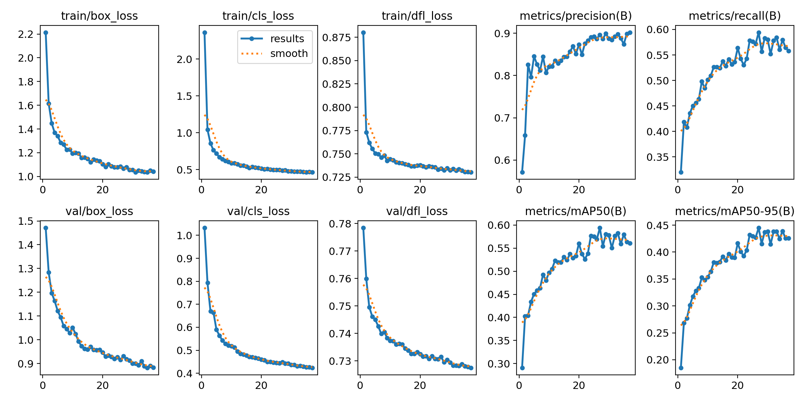
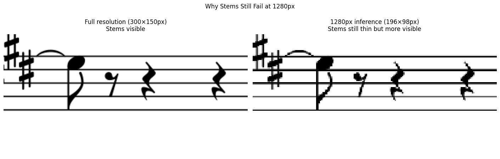

# Check-in 3: Advanced Extension

## Overview
This check-in extends the YOLOv8s baseline from Check-in 2 in two ways:
1. **Advanced extension:** RT-DETR, a transformer-based object detector, replacing the CNN backbone with an attention-based architecture
2. **Ablation:** YOLOv8s trained at higher resolution (imgsz=1280) to directly address the stem/ledgerLine zero-detection failure identified in Check-in 2

See the full notebook: [`notebooks/advanced_extension.ipynb`](../notebooks/advanced_extension.ipynb)

---

## 1. Advanced Extension: RT-DETR (Transformer-Based Detection)

### Motivation
The main problem found in Check-in 2 was complete zero-detection on stem, ledgerLine, and augmentationDot. These are all thin/small symbols that disappear when high-resolution sheet music is downscaled to 640px. Another motivation was trying to compare the purely CNN approach in YOLOv8 with RT-DETR which has a transformer-based encoder (AIFI = Attention-based Intra-scale Feature 
Interaction), which may better capture global context and long-range dependencies between symbols.

### Architecture
RT-DETR-L uses:
- HGNet backbone (hybrid CNN feature extractor)
- AIFI transformer encoder for multi-scale feature interaction
- RT-DETR decoder with learned object queries

Key difference from YOLOv8: the AIFI module applies self-attention across spatial positions at the highest feature map level, allowing the model to reason about relationships between distant symbols. This could potentially help with context-dependent 
classes like `accidentalFlat` vs `keyFlat`.

Model size: 32.8M parameters, 108.1 GFLOPs (vs YOLOv8s: 11.1M params, 28.7 GFLOPs)

### Training Configuration
- Model: RT-DETR-L (pretrained on COCO)
- Image size: 640px
- Batch size: 4
- Epochs: 50 (patience=10)
- Hardware: Tesla T4 (Google Colab)
- Dataset: DeepScores V2 dense subset (same as Check-in 2)

### Results
<!-- To be filled in after training -->

---

## 2. Ablation: YOLOv8s at Higher Resolution (imgsz=1280)

### Motivation
The stem/ledgerLine zero-detection failure in Check-in 2 was directly caused by downscaling 1960×2772px sheet music pages to 640px for inference. Stems that are 3-4px wide at full resolution become less than a pixel wide and invisible. Training and inferring at 1280px might help save some of the more fine-grained detail.

### Training Configuration
- Model: YOLOv8s (same architecture as Check-in 2 baseline)
- Image size: 1280px (vs 640px in baseline)
- Batch size: 4 (reduced from 8 due to memory)
- Epochs: 50 (patience=10)
- Everything else identical to Check-in 2

### Results
Training completed in 2.26 hours on a Tesla T4 GPU, with early stopping triggering at epoch 37 (best model at epoch 27).

**Overall mAP@0.5: 0.594 | mAP@0.5:0.95: 0.445**

This represents a 0.105 improvement in mAP@0.5 over the 640px baseline (0.489) using the identical model architecture. This was a 21% relative gain purely from resolution.

| Class | mAP@0.5 (640px) | mAP@0.5 (1280px) | Δ |
|---|---|---|---|
| noteheadBlackOnLine | 0.773 | 0.785 | +0.012 |
| noteheadBlackInSpace | 0.773 | 0.685 | -0.088 |
| noteheadHalfOnLine | 0.605 | 0.801 | +0.196 |
| noteheadHalfInSpace | 0.577 | 0.774 | +0.197 |
| noteheadWholeOnLine | 0.620 | 0.874 | +0.254 |
| noteheadWholeInSpace | 0.596 | 0.818 | +0.222 |
| ledgerLine | 0.000 | 0.000 | 0.000 |
| stem | 0.000 | 0.000 | 0.000 |
| beam | 0.595 | 0.363 | -0.232 |
| flag8thDown | 0.680 | 0.615 | -0.065 |
| flag8thUp | 0.511 | 0.471 | -0.040 |
| flag16thDown | 0.200 | 0.453 | +0.253 |
| flag16thUp | 0.162 | 0.562 | +0.400 |
| restQuarter | 0.835 | 0.854 | +0.019 |
| restHalf | 0.276 | 0.563 | +0.287 |
| restWhole | 0.465 | 0.601 | +0.136 |
| rest8th | 0.769 | 0.755 | -0.014 |
| clefG | 0.995 | 0.994 | -0.001 |
| clefF | 0.976 | 0.985 | +0.009 |
| timeSig4 | 0.487 | 0.742 | +0.255 |
| timeSig3 | 0.112 | 0.184 | +0.072 |
| timeSig2 | 0.077 | 0.298 | +0.221 |
| timeSigCommon | 0.260 | 0.525 | +0.265 |
| timeSigCutCommon | 0.684 | 0.625 | -0.059 |
| accidentalSharp | 0.553 | 0.824 | +0.271 |
| accidentalFlat | 0.299 | 0.642 | +0.343 |
| accidentalNatural | 0.248 | 0.234 | -0.014 |
| keySharp | 0.777 | 0.884 | +0.107 |
| keyFlat | 0.755 | 0.775 | +0.020 |
| augmentationDot | 0.000 | 0.134 | +0.134 |


#### Confusion Matrix Comparison

The normalized confusion matrices below show detection patterns for both YOLOv8s models. The diagonal represents correct detections where darker = better.

#### 1280 px


#### 640 px


Key observations:
- The diagonal is consistently stronger at 1280px for notehead variants, accidentals, and time signatures. This confirms the quantitative improvements
- `stem` and `ledgerLine` rows are entirely blank in both matrices. There are zero detections regardless of resolution, confirming an annotation-level failure
- The `background` row shows where missed detections go. Both models struggle with the same classes (thin symbols, rare classes)
- `beam` confusion pattern is similar across both resolutions, suggesting the mAP regression at 1280px is an IoU precision issue rather than outright misclassification

#### Training Curves

#### 1280 px




#### 640 px


The 1280px model shows steeper loss curves and higher final precision/recall, converging to a better optimum despite early stopping at epoch 37. 

### Failure Analysis

**Unchanged failures — stem and ledgerLine (mAP@0.5 = 0.000)**
Despite doubling inference resolution, stem and ledgerLine detection remains at zero. This might mean that this is an annotation quality issue. Stem bounding boxes in DeepScores V2 are extremely thin (1-2px wide at full resolution), which might make it really difficult for any detector to achieve sufficient IoU overlap, even when the stem is visually there. A specialized thin-structure detector or a different annotation strategy (e.g. skeleton-based representation) might be needed to solve this.



**Beam regression (0.595 → 0.363)**
Weirdly, beam detection got worse at higher resolution. The likely cause is IoU threshold sensitivity. The beam bounding boxes are very wide and thin, and at 1280px, small localization errors are penalized more heavily by the 0.5 IoU threshold. The model is finding beams but drawing slightly imprecise boxes around them.

**augmentationDot now detected (0.000 → 0.134)**
This is a meaningful improvement. Augmentation dots were completely invisible at 640px but are now being detected at 1280px, confirming that resolution was the limiting factor for this class specifically.

**Overall pattern**
Higher resolution helps most for: small isolated symbols (dots, accidentals, flags, whole notes) where the limiting factor was pixel-level detail. It helps least for: structurally thin symbols (stems, ledger lines) where the annotation format is the bottleneck, and wide thin symbols (beams) where IoU scoring becomes harder.

---

## 3. Comparison

### Metrics Summary

| Model | imgsz | mAP@0.5 | mAP@0.5:0.95 | stem AP | ledgerLine AP | augDot AP |
|---|---|---|---|---|---|---|
| YOLOv8s (Check-in 2) | 640 | 0.489 | 0.275 | 0.000 | 0.000 | 0.000 |
| YOLOv8s (ablation) | 1280 | coming soon | coming soon | coming soon | coming soon | coming soon |
| RT-DETR-L (advanced) | 640 | coming soon | coming soon | coming soon | coming soon | coming soon |

### Discussion
<!-- To be filled in after training -->

---

## 4. RT-DETR Failure Analysis


---

## 5. End-to-End Demo
The full pipeline demo is available as a local Gradio app in `app.py`.

**To run:**
```bash
pip install ultralytics gradio music21 midi2audio
brew install fluidsynth  # Mac only
python app.py
```

Then upload any printed sheet music image and the app will detect symbols, convert to MIDI, and play audio in the browser.

---

## 6. Plan for Final Deliverable

**Remaining work:**
- Polish demo app
- Final report write-up combining all three check-ins into a coherent narrative
- Presentation slides

**Highest priority next steps:**
- Improve pitch calibration in midi_converter.py

**Known risks:**
- RT-DETR may not outperform YOLOv8s on this dataset despite larger size
- 1280px training may still not detect stems if the issue is annotation quality rather than resolution
- Gradio app requires local fluidsynth installation which may complicate the demo setup